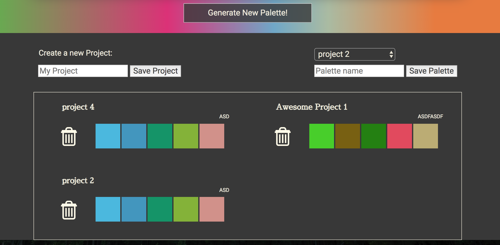

# Palette Picker

Palette Picker generates and saves color palettes by project.

## Getting Started

To get the app up and running, enter the following commands in the terminal:

```
git clone https://github.com/dsdunn/pallete-picker
cd pallete-picker
npm install
npm start
```

## Running the tests

The testing suite is built with Enzyme and Jest. To run:

```
npm test
```


## Built With

* [React](https://reactjs.org/) - (create-react-app)
* [React-Router](https://reacttraining.com/react-router/web/guides/philosophy) 
* [Redux](https://redux.js.org/)
* [google-map-react](https://www.npmjs.com/package/google-map-react) 


## Authors

* **David Starr Dunn** - *Initial work* - [@dsdunn](https://github.com/dsdunn)





